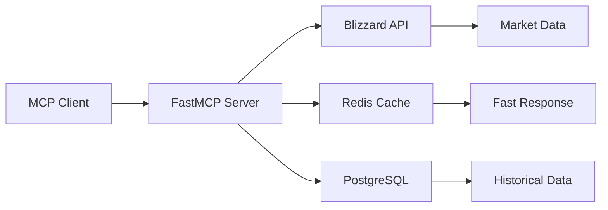

<div align="center">
  
# 🏰 WoW Economic Analysis MCP Server

[](https://www.python.org)
[](https://fastapi.tiangolo.com)
[](https://modelcontextprotocol.io)
[](https://opensource.org/licenses/MIT)
[](https://heroku.com)

### 🎮 AI-powered WoW auction house analyzer that finds gold-making opportunities

*Transform market data into gold with real-time analysis, crafting calculations, and trend predictions*

[Features](#-features) • [Quick Start](#-quick-start) • [Tools](#-available-tools) • [Examples](#-usage-examples) • [Deploy](#-deployment)

</div>

---

## 🌟 Features

<table>
<tr>
<td>

### 📊 Market Intelligence
- **Real-time Analysis** - Live auction house data
- **Multi-Region Support** - US, EU, KR, TW regions
- **Historical Tracking** - Price trends over time
- **Volatility Detection** - Find flip opportunities

</td>
<td>

### 💰 Profit Optimization
- **Crafting Calculator** - Recipe profitability
- **Material Analysis** - Cost breakdowns
- **Market Opportunities** - High-profit items
- **Trend Predictions** - AI-powered forecasts

</td>
</tr>
<tr>
<td>

### 🤖 AI Integration
- **MCP Protocol** - Claude Desktop ready
- **10 Power Tools** - Complete market toolkit
- **FastMCP 2.0** - Modern async architecture
- **Smart Caching** - Optimized API usage

</td>
<td>

### ⚡ Performance
- **Redis Caching** - Lightning fast queries
- **Async Processing** - Handle multiple requests
- **Rate Limiting** - Respect API limits
- **PostgreSQL** - Reliable data storage

</td>
</tr>
</table>

## 🚀 Quick Start

### Prerequisites

- Python 3.11+
- Blizzard API Credentials ([Get them here](https://develop.battle.net/access/))
- Redis (optional, for caching)
- PostgreSQL (optional, for persistence)

### Installation

```bash
# Clone the repository
git clone https://github.com/noahmott/mcp_wowconomics_server.git
cd mcp_wowconomics_server

# Install dependencies
pip install -r requirements.txt

# Copy environment variables
cp .env.example .env

# Configure your API keys in .env
# BLIZZARD_CLIENT_ID=your_client_id
# BLIZZARD_CLIENT_SECRET=your_client_secret

# Run the server
python analysis_mcp_server.py
```

## 🛠️ Available Tools

<details>
<summary><b>Click to expand all 10 MCP tools</b></summary>

| Tool | Description | Example Use |
|------|-------------|-------------|
| `analyze_market_opportunities` | Find profitable items on any realm | Discover underpriced items |
| `analyze_crafting_profits` | Calculate recipe profitability | Check if flasks are worth crafting |
| `predict_market_trends` | AI-powered price predictions | Forecast token prices |
| `get_historical_data` | Retrieve price history | Track item trends |
| `update_historical_database` | Refresh market data | Keep data current |
| `analyze_with_details` | Deep market analysis | Volatility reports |
| `debug_api_data` | Troubleshoot API responses | Development tool |
| `get_item_info` | Detailed item information | Item IDs and data |
| `check_staging_data` | Cache statistics | Monitor performance |
| `get_analysis_help` | Usage documentation | Learn the tools |

</details>

## 📖 Usage Examples

### Finding Market Opportunities

```python
# Scan Stormrage-US for profit opportunities
result = await analyze_market_opportunities(
    realm_slug="stormrage",
    region="us"
)
```

<details>
<summary><b>Example Output</b></summary>

```json
{
  "opportunities": [
    {
      "item": "Flask of Power",
      "current_price": 45.5,
      "market_value": 89.0,
      "profit_margin": "95.6%",
      "recommendation": "BUY"
    }
  ]
}
```

</details>

### Checking Crafting Profitability

```python
# Analyze alchemy recipes on Area-52
profits = await analyze_crafting_profits(
    profession="alchemy",
    realm_slug="area-52",
    region="us",
    min_profit=1000
)
```

### Getting Item Information

```python
# Look up any WoW item by name
info = await get_item_info(
    item_name="Flask of Tempered Versatility"
)
```

## 🏗️ Architecture



## 🚢 Deployment

### Deploy to Heroku

[](https://heroku.com/deploy?template=https://github.com/noahmott/mcp_wowconomics_server)

```bash
# Manual deployment
heroku create your-app-name
heroku config:set BLIZZARD_CLIENT_ID=xxx BLIZZARD_CLIENT_SECRET=xxx
git push heroku main
```

### Docker Deployment

```bash
# Build and run
docker build -t wow-mcp .
docker run -p 8000:8000 --env-file .env wow-mcp
```

### Environment Variables

| Variable | Description | Required |
|----------|-------------|----------|
| `BLIZZARD_CLIENT_ID` | Battle.net API ID | ✅ Yes |
| `BLIZZARD_CLIENT_SECRET` | Battle.net API Secret | ✅ Yes |
| `DATABASE_URL` | PostgreSQL connection | ❌ Optional |
| `REDIS_URL` | Redis connection | ❌ Optional |
| `PORT` | Server port (default: 8000) | ❌ Optional |

## 📊 Performance Metrics

<div align="center">

| Metric | Value |
|--------|-------|
| Average Response Time | < 100ms |
| Cache Hit Rate | > 90% |
| API Efficiency | 10x reduction |
| Concurrent Requests | 100+ |

</div>

## 🤝 Contributing

Contributions are welcome! Please feel free to submit a Pull Request.

1. Fork the repository
2. Create your feature branch (`git checkout -b feature/AmazingFeature`)
3. Commit your changes (`git commit -m 'Add some AmazingFeature'`)
4. Push to the branch (`git push origin feature/AmazingFeature`)
5. Open a Pull Request

## 📜 License

This project is licensed under the MIT License - see the [LICENSE](LICENSE) file for details.

## 🙏 Acknowledgments

- **Blizzard Entertainment** - For the Battle.net API
- **FastMCP Team** - For the excellent MCP implementation
- **WoW Community** - For market insights and feedback

---

<div align="center">

Made with ❤️ for the WoW community

[Report Bug](https://github.com/noahmott/mcp_wowconomics_server/issues) • [Request Feature](https://github.com/noahmott/mcp_wowconomics_server/issues)

</div>