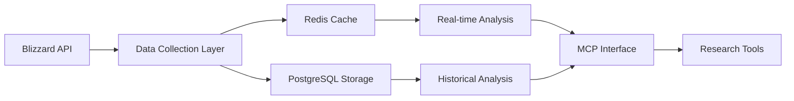

## 📁 Project Structure

```
guilddiscordbot/
├── config/                 # Configuration files
│   └── docker/            # Docker configuration
├── scripts/               # Utility scripts
│   ├── startup/          # Application startup scripts
│   └── deployment/       # Deployment configurations
├── docs/                  # Documentation
│   ├── api/              # API documentation
│   ├── architecture/     # System design docs
│   ├── development/      # Development guides
│   └── deployment/       # Deployment guides
├── app/                   # Main application (being migrated)
├── wow_guild_analytics/   # Modular architecture
└── tests/                # Test suite
```

### 🚀 Quick Start

```bash
# Using Docker
docker-compose -f config/docker/docker-compose.yml up

# Local development (Windows)
scripts\startup\scripts\startup\start_server.bat

# Local development (Linux/Mac)
./scripts/startup/startup.sh
```

### 📖 Documentation

- [Architecture Overview](docs/architecture/DESIGN_DOCUMENT.md)
- [MCP Usage Guide](docs/api/MCP_USAGE.md)
- [Development Standards](docs/development/PEP8_COMPLIANCE.md)
- [File Organization](docs/development/FILE_ORGANIZATION.md)

<div align="center">
  
# 📊 WoW Economic Analysis MCP Server

### Academic Research Tool for Virtual Economy Analysis

[](https://www.python.org)
[](https://www.postgresql.org)
[](https://develop.battle.net)
[](https://claude.ai)
[](https://wow-guild-mcp-server-7f17b3f6ea0a.herokuapp.com/)
[](https://opensource.org/licenses/MIT)

**A research-grade Model Context Protocol server for analyzing World of Warcraft's virtual economy**

*Providing quantitative analysis tools for academic research in digital economies, market dynamics, and behavioral economics*

</div>

<div align="center">

[](https://fastapi.tiangolo.com)
[](https://pandas.pydata.org)
[](https://numpy.org)
[](https://plotly.com)
[](https://openai.com)
[](https://redis.io)
[](https://www.sqlalchemy.org)

[Overview](#-overview) • [Research Applications](#-research-applications) • [Methodology](#-methodology) • [Tools](#-analysis-tools) • [Data](#-data-collection)

</div>

---

## 🆕 What's New (July 2025)

- **WoW Classic Support**: Full support for WoW Classic API endpoints with `static-classic` namespace
- **Dual Version Updates**: Scheduled updates can now pull data from both Classic and Retail
- **Aggregate Market Snapshots**: Now capturing comprehensive market data instead of individual price points
- **PostgreSQL Storage**: Persistent data storage with 30-day retention
- **Market Velocity Tracking**: New metrics for turnover rates and estimated sales
- **Enhanced Security**: Resource limits to prevent DoS and ensure stable operation
- **11 Analysis Tools**: Added `query_aggregate_market_data` and `check_database_status`

## 📚 Overview

This MCP server provides researchers with sophisticated tools to analyze World of Warcraft's auction house economy, one of the most complex virtual economies with millions of daily transactions across hundreds of server markets. The system enables quantitative research in:

- **Market Microstructure** - Price discovery, bid-ask spreads, market efficiency
- **Behavioral Economics** - Player trading patterns, decision-making under uncertainty
- **Network Effects** - Cross-server arbitrage, information propagation
- **Time Series Analysis** - Price volatility, seasonal patterns, trend forecasting

## 🔬 Research Applications

<table>
<tr>
<td>

### Economic Theory Testing
- **Market Efficiency** - Test EMH in virtual markets
- **Price Discovery** - Analyze information flow
- **Arbitrage** - Study cross-market opportunities
- **Supply/Demand** - Model equilibrium dynamics

</td>
<td>

### Data Science Applications
- **Time Series Forecasting** - ARIMA, Prophet models
- **Volatility Analysis** - GARCH modeling
- **Clustering** - Market segmentation
- **Anomaly Detection** - Unusual trading patterns

</td>
</tr>
<tr>
<td>

### Behavioral Studies
- **Trading Psychology** - Risk preferences
- **Social Networks** - Guild trading patterns
- **Learning Curves** - New player behavior
- **Market Manipulation** - Detection algorithms

</td>
<td>

### Computational Economics
- **Agent-Based Models** - Simulate markets
- **Machine Learning** - Price predictions
- **Network Analysis** - Trade relationships
- **High-Frequency Data** - Microsecond analysis

</td>
</tr>
</table>

## 🔍 Methodology

### Data Collection Framework



### Statistical Methods Implemented

- **Descriptive Statistics** - Mean, median, standard deviation, quantiles
- **Time Series Decomposition** - Trend, seasonal, residual components
- **Volatility Measures** - Historical volatility, EWMA, GARCH
- **Market Metrics** - Liquidity ratios, turnover rates, price impact

## 🛠️ Analysis Tools

<details>
<summary><b>Click to view all 11 research tools</b></summary>

| Tool | Research Application | Output Format |
|------|---------------------|---------------|
| `analyze_market_opportunities` | Arbitrage detection, market inefficiencies | JSON with statistical metrics |
| `analyze_crafting_profits` | Production economics, value chains | Profit margins, breakeven analysis |
| `predict_market_trends` | Time series forecasting, trend analysis | Predictions with confidence intervals |
| `get_historical_data` | Data collection for research | CSV-ready time series data |
| `update_historical_database` | Maintain research dataset | Database update confirmation |
| `query_aggregate_market_data` | Access aggregate market snapshots | Market volume, depth, velocity metrics |
| `analyze_with_details` | Deep statistical analysis | Comprehensive research report |
| `debug_api_data` | Data quality validation | Raw API response analysis |
| `get_item_info` | Item classification, categorization | Detailed item metadata |
| `check_database_status` | Database health and storage metrics | Connection status, record counts |
| `get_analysis_help` | Documentation for researchers | Tool usage guidelines |

</details>

## 📈 Data Collection

### Available Datasets

- **Price Time Series** - Minute-level granularity across all realms
- **Volume Data** - Transaction quantities and frequencies
- **Cross-Sectional Data** - Item attributes, rarity, level requirements
- **Network Data** - Server connections, faction markets

### Data Quality & Storage

- **Coverage**: 200+ US/EU realms available via API
- **Active Monitoring**: Currently tracking 10 US realms with automatic rotation
- **Item Coverage**: Top 100-200 most-traded items per realm (configurable)
- **Frequency**: Hourly snapshots via Blizzard API
- **History**: 30-day aggregate snapshots, 7-day detailed price distributions
- **Storage**: PostgreSQL with aggregate market snapshots
- **Data Points**: 2,200+ market snapshots collected daily

### New: Aggregate Market Data (2025)

The system now captures comprehensive market aggregates instead of individual price points:

- **Market Snapshots**: Total quantity, auction count, unique sellers per item
- **Price Statistics**: Min, max, average, median, standard deviation
- **Market Concentration**: Top seller percentage, seller distribution
- **Price Distributions**: Detailed breakdown by price points
- **Market Velocity**: Turnover rates, listing changes, estimated sales

### Current Limitations

⚠️ **Important for Researchers:**

1. **API Rate Limits**: Blizzard API provides hourly snapshots, limiting real-time analysis

2. **Item Selection**: Tracks top 100-200 most-traded items per realm (configurable via `top_items` parameter)

3. **Resource Constraints**: Security limits prevent tracking all items across all realms simultaneously

4. **Historical Depth**: 30-day retention for aggregate data, 7-day for detailed distributions

To customize for your research:
- Call `update_historical_database` with specific parameters:
  - `realms`: Target specific servers (e.g., `"mal-ganis:us,kiljaeden:us"`)
  - `top_items`: Adjust item coverage (max 500)
  - `include_all_items`: Track all items for a realm (resource intensive)
- Use `query_aggregate_market_data` for different analyses:
  - `query_type`: "top_items", "market_depth", "price_trends", "market_velocity"
- Deploy your own instance for unlimited access

## 🚀 Quick Start for Researchers

### Quick Connection for Claude.ai

Connect directly using this MCP endpoint:
```
https://wow-guild-mcp-server-7f17b3f6ea0a.herokuapp.com/mcp/
```

### Option 1: Connect via MCP Client (Recommended)

Researchers can directly connect to our hosted MCP endpoint without local installation:

```python
from fastmcp import Client

# Connect to the research server
async with Client("https://wow-guild-mcp-server-7f17b3f6ea0a.herokuapp.com/mcp/") as client:
    # List available research tools
    tools = await client.list_tools()
    
    # Execute analysis
    result = await client.call_tool(
        "analyze_market_opportunities",
        {"realm_slug": "stormrage", "region": "us"}
    )
```

**Benefits:**
- No local setup required
- Always up-to-date with latest analysis methods
- Automatic scaling for large datasets
- Maintained infrastructure

### Option 2: Local Installation

For researchers who need custom modifications or offline analysis:

#### Prerequisites

- Python 3.11+ with scientific computing libraries
- Blizzard API Credentials ([Academic Access](https://develop.battle.net/access/))
- PostgreSQL for data persistence (optional)
- Redis for real-time caching (optional)

#### Installation

```bash
# Clone the repository
git clone https://github.com/noahmott/mcp_wowconomics_server.git
cd mcp_wowconomics_server

# Create virtual environment
python -m venv venv
source venv/bin/activate  # On Windows: venv\Scripts\activate

# Install dependencies
pip install -r requirements.txt

# Configure environment
cp .env.example .env
# Add your Blizzard API credentials to .env
# Set WOW_VERSION=classic for WoW Classic or WOW_VERSION=retail for regular WoW

# Start the server
python analysis_mcp_server.py
```

## 📖 Usage Examples

### Market Efficiency Analysis

```python
# Test for arbitrage opportunities across servers
opportunities = await analyze_market_opportunities(
    realm_slug="stormrage",
    region="us"
)

# Results include statistical significance tests
print(f"Arbitrage profit margin: {opportunities['profit_margin']}%")
print(f"Statistical confidence: {opportunities['confidence_level']}")
```

### Time Series Forecasting

```python
# Predict future prices using historical data
predictions = await predict_market_trends(
    item_id=168487,  # Zin'anthid
    realm_slug="area-52",
    forecast_periods=24  # 24 hours ahead
)

# Access prediction intervals
for forecast in predictions['forecasts']:
    print(f"Time: {forecast['timestamp']}")
    print(f"Predicted Price: {forecast['price']} ± {forecast['std_dev']}")
```

### Volatility Analysis

```python
# Analyze price volatility for risk assessment
analysis = await analyze_with_details(
    analysis_type="volatility",
    realm_slug="stormrage",
    top_n=50
)

# Returns GARCH model parameters and volatility clusters
print(f"Average volatility: {analysis['avg_volatility']}%")
print(f"Volatility clusters detected: {analysis['cluster_count']}")
```

### Market Depth Analysis (New)

```python
# Query aggregate market data for volume analysis
market_data = await query_aggregate_market_data(
    realm_slug="stormrage",
    region="us",
    query_type="top_items",
    limit=20
)

# Analyze specific item's market depth
depth_analysis = await query_aggregate_market_data(
    realm_slug="stormrage",
    region="us",
    query_type="market_depth",
    item_id="168487"  # Zin'anthid
)

# Track market velocity and turnover
velocity = await query_aggregate_market_data(
    query_type="market_velocity",
    realm_slug="area-52",
    hours=24
)
```

## 🔌 MCP Integration for Research Clients

### Supported MCP Clients

Researchers can connect using any MCP-compatible client:

- **Claude Desktop** - For interactive analysis and exploration
- **Python FastMCP** - For programmatic research workflows
- **Custom MCP Clients** - Any client implementing the MCP protocol

### Connection Details

```yaml
Server Endpoint: https://wow-guild-mcp-server-7f17b3f6ea0a.herokuapp.com/mcp/
Protocol: MCP 2.0 (HTTP Transport with SSE)
Authentication: None required for public research data
Rate Limits: 100 requests/minute per client
```

### Example: Jupyter Notebook Integration

```python
import asyncio
from fastmcp import Client
import pandas as pd

async def fetch_market_data(realm, region="us"):
    """Fetch market data for research analysis"""
    async with Client("https://wow-guild-mcp-server-7f17b3f6ea0a.herokuapp.com/mcp/") as client:
        # Get historical data
        historical = await client.call_tool(
            "get_historical_data",
            {"realm_slug": realm, "region": region}
        )
        
        # Convert to DataFrame for analysis
        df = pd.DataFrame(historical['data'])
        return df

# Use in research
df = await fetch_market_data("stormrage")
df.describe()  # Statistical summary
```

## 📊 Data Export

The server supports multiple export formats for research:

- **CSV** - For statistical software (R, Stata, SPSS)
- **JSON** - For programmatic analysis
- **Parquet** - For big data frameworks
- **SQL** - Direct database access for complex queries

## 🤝 Contributing to Research

We welcome contributions from researchers:

1. **Empirical Studies** - Use our data for your research
2. **Methodological Improvements** - Enhance analysis algorithms
3. **New Metrics** - Propose novel economic indicators
4. **Validation** - Cross-validate findings with other virtual economies

### Citation

If you use this tool in your research, please cite:

```bibtex
@software{mcp_wowconomics,
  author = {Mott, Noah},
  title = {WoW Economic Analysis MCP Server},
  year = {2025},
  publisher = {GitHub},
  url = {https://github.com/noahmott/mcp_wowconomics_server}
}
```

## 📜 License

This project is licensed under the MIT License, encouraging academic use and collaboration.

## 🙏 Acknowledgments

- **Blizzard Entertainment** - For providing API access to researchers
- **FastMCP Team** - For the Model Context Protocol implementation
- **Academic Community** - For virtual economy research foundations

---

<div align="center">

**Advancing Virtual Economy Research Through Open Data**

[Documentation](https://github.com/noahmott/mcp_wowconomics_server/wiki) • [Dataset Requests](https://github.com/noahmott/mcp_wowconomics_server/issues) • [Research Collaboration](mailto:noah.mott1@gmail.com)

</div>