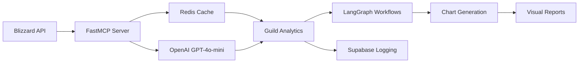

## 📁 Project Structure

```
guilddiscordbot/
├── app/                   # Main application directory
│   ├── api/              # Blizzard API client and integrations
│   ├── models/           # Database models
│   ├── services/         # Business logic services
│   ├── utils/            # Utility functions
│   ├── visualization/    # Chart generation
│   ├── workflows/        # Complex multi-step operations
│   └── mcp_server_fastmcp.py  # Main MCP server
├── config/               # Configuration files
│   ├── docker/           # Docker configuration
│   └── supabase/         # Database schema
├── docs/                 # Documentation
│   ├── api/              # API documentation
│   ├── architecture/     # System design docs
│   └── development/      # Development guides
└── data/                 # Data storage
    └── historical/       # Historical data cache
```

### 🚀 Quick Start

```bash
# Using Docker
docker-compose -f config/docker/docker-compose.yml up

# Local development
python app/mcp_server_fastmcp.py
```

### 📖 Documentation

- [Architecture Overview](docs/architecture/DESIGN_DOCUMENT.md)
- [MCP Usage Guide](docs/api/MCP_USAGE.md)
- [Development Standards](docs/development/PEP8_COMPLIANCE.md)

<div align="center">
  
# 🏰 WoW Guild Analytics MCP Server

### Advanced Guild Management and Performance Analysis Tool

[](https://www.python.org)
[](https://github.com/jlowin/fastmcp)
[](https://develop.battle.net)
[](https://openai.com)
[](https://wow-guild-mcp-server-7f17b3f6ea0a.herokuapp.com/)
[](https://opensource.org/licenses/MIT)

**A comprehensive Model Context Protocol server for World of Warcraft guild analytics and management**

*Empowering guild officers and leaders with AI-powered insights, performance tracking, and member analysis*

</div>

<div align="center">

[](https://fastapi.tiangolo.com)
[](https://redis.io)
[](https://matplotlib.org)
[](https://seaborn.pydata.org)
[](https://langchain.com)
[](https://supabase.com)
[](https://github.com/jlowin/fastmcp)

[Overview](#-overview) • [Guild Analytics](#-guild-analytics-tools) • [Features](#-key-features) • [Tools](#-complete-tool-reference) • [Quick Start](#-quick-start)

</div>

---

## 🆕 What's New (July 2025)

- **Redis Caching Integration**: Guild rosters cached for 15 days, reducing API calls and improving performance
- **Economy Snapshot System**: Hourly auction house data capture with 30-day historical retention
- **AI-Powered Guild Insights**: OpenAI GPT-4o-mini integration for intelligent guild analysis and recommendations
- **Advanced Chart Generation**: Matplotlib/seaborn visualization for raid progress and member performance
- **WoW Classic & Retail Support**: Full support for both Classic and Retail WoW with proper API namespaces
- **Real-time Activity Tracking**: Supabase integration for comprehensive usage analytics and logging
- **LangGraph Workflows**: Multi-step analysis chains for complex guild performance evaluations
- **15 Comprehensive Tools**: 7 guild analytics + 8 market/economy tools including new snapshot features

## 📚 Overview

This MCP server provides guild officers, leaders, and WoW community managers with comprehensive analytics tools for World of Warcraft guild management and performance analysis. Built on FastMCP 2.0 with AI-powered insights, the system enables deep understanding of:

- **Guild Performance Analytics** - Member progression, activity patterns, and performance metrics
- **Individual Member Analysis** - Character profiles, equipment optimization, and achievement tracking  
- **Raid Team Management** - Progression tracking, performance comparisons, and team composition
- **Market Intelligence** - Auction house monitoring and economic opportunities for guild funding

## 🏰 Guild Analytics Tools

<table>
<tr>
<td>

### Performance Analysis
- **Guild Overview** - Comprehensive performance metrics with AI insights
- **Member Tracking** - Individual character progression and statistics
- **Raid Progress** - Visual charts of raid team advancement
- **Comparative Analysis** - Side-by-side member performance comparison

</td>
<td>

### Management Features
- **Member Roster** - Detailed guild member listings with sorting/filtering
- **Activity Monitoring** - Real-time tracking of guild analytics usage
- **Performance Charts** - Visual representations of guild and member data
- **AI Recommendations** - Intelligent suggestions for guild improvement

</td>
</tr>
<tr>
<td>

### Market Intelligence
- **Auction House Monitoring** - Current market snapshots and trends
- **Profit Opportunities** - Market analysis for guild funding strategies
- **Item Lookup** - Detailed item information and market values
- **Cross-Realm Analysis** - Compare markets across different servers

</td>
<td>

### Technical Features
- **Multi-Version Support** - Both Classic and Retail WoW compatibility
- **Real-time Logging** - Supabase integration for activity tracking
- **Redis Caching** - Optimized performance for frequent queries
- **Chart Generation** - Matplotlib/seaborn visualization without Chrome

</td>
</tr>
</table>

## 🔍 Key Features

### AI-Powered Analysis Architecture



### Advanced Analytics Capabilities

- **AI Guild Insights** - GPT-4o-mini powered analysis and recommendations
- **Performance Metrics** - Member progression, activity patterns, achievement tracking
- **Visual Analytics** - Matplotlib/seaborn charts for raid progress and comparisons
- **Real-time Monitoring** - Supabase activity logging and usage analytics
- **Redis Caching** - 15-day guild roster cache, hourly economy snapshots
- **Historical Analysis** - 30-day price trend data for market analysis

## 🛠️ Complete Tool Reference

<details>
<summary><b>Click to view all 15 analytics tools</b></summary>

### 🏰 Guild Analytics Tools (7)

| Tool | Purpose | Output Format |
|------|---------|---------------|
| `analyze_guild_performance` | Comprehensive guild analysis with AI insights | Detailed performance report with recommendations |
| `get_guild_member_list` | Guild roster with sorting and filtering (Redis cached) | JSON member data with cache status |
| `analyze_member_performance` | Individual character analysis | Equipment, achievements, and progression data |
| `generate_raid_progress_chart` | Visual raid progression tracking | Matplotlib/seaborn charts (PNG) |
| `compare_member_performance` | Side-by-side member comparisons | Comparative analysis with visualizations |
| `test_supabase_connection` | Activity logging and monitoring | Connection status and usage analytics |

### 📈 Market Intelligence Tools (8)

| Tool | Purpose | Output Format |
|------|---------|---------------|
| `get_realm_status` | Realm status and connected realm ID lookup | Realm information with population and ID |
| `get_auction_house_snapshot` | Current auction house data | Real-time market snapshots |
| `capture_economy_snapshot` | Hourly economy data capture (new) | Snapshot results with item statistics |
| `get_economy_trends` | Historical price trends (new) | 30-day price history for items |
| `analyze_item_market_history` | Market trends and analysis | Price history and trend analysis |
| `find_market_opportunities` | Profit margin identification | Market opportunity reports |
| `lookup_item_details` | Item information lookup | Detailed item metadata |
| `lookup_multiple_items` | Batch item information | Multiple item data analysis |

### 🔧 Utility Tools (1)

| Tool | Purpose | Output Format |
|------|---------|---------------|
| `test_classic_auction_house` | Classic WoW auction house testing | Diagnostic information |

</details>

## 📊 Data Sources & Coverage

### Available Data Types

- **Guild Information** - Complete roster, activity, and progression data
- **Character Profiles** - Equipment, achievements, statistics, and performance metrics  
- **Market Data** - Real-time auction house snapshots and item information
- **Activity Logs** - Comprehensive usage tracking and analytics via Supabase

### API Coverage & Capabilities

- **Realm Coverage**: All US/EU realms supported via Blizzard Battle.net API
- **WoW Versions**: Full support for both Classic and Retail with proper namespace handling
- **Data Freshness**: Real-time guild and character data, hourly auction house updates
- **Redis Caching**: 
  - Guild rosters: 15-day TTL (reduces API calls by ~90%)
  - Economy snapshots: Hourly captures with 30-day retention
  - Automatic cache invalidation after TTL expiry
- **Storage**: Supabase for activity tracking with 30-day retention

### Guild Analytics Capabilities

The system provides comprehensive guild analysis through multiple data sources:

- **Member Tracking**: Real-time roster data with character progression metrics
- **Performance Analysis**: Equipment optimization, achievement tracking, activity patterns
- **Raid Progression**: Visual charts showing team advancement and performance trends
- **AI Insights**: GPT-4o-mini powered recommendations for guild improvement strategies

### Current System Features

✅ **Optimized for Guild Management:**

1. **Real-time Data**: Direct Blizzard API integration for current guild and member information

2. **AI-Enhanced Analysis**: OpenAI integration provides intelligent insights and recommendations

3. **Visual Reports**: Matplotlib/seaborn chart generation without external dependencies

4. **Activity Monitoring**: Comprehensive Supabase logging for usage analytics and performance tracking

5. **Multi-Version Support**: Handles both Classic and Retail WoW with appropriate API namespaces

Guild officers can leverage these tools for:
- **Member recruitment** and retention analysis
- **Raid team optimization** and progression tracking  
- **Performance monitoring** and improvement recommendations
- **Market opportunities** for guild funding strategies

## 🚀 Quick Start

### Quick Connection for Guild Officers

Connect directly using this MCP endpoint:
```
https://wow-guild-mcp-server-7f17b3f6ea0a.herokuapp.com/mcp/
```

### Option 1: Connect via MCP Client (Recommended)

Guild officers can directly connect to our hosted MCP endpoint without local installation:

```python
from fastmcp import Client

# Connect to the guild analytics server
async with Client("https://wow-guild-mcp-server-7f17b3f6ea0a.herokuapp.com/mcp/") as client:
    # List available guild tools
    tools = await client.list_tools()
    
    # Analyze your guild performance
    result = await client.call_tool(
        "analyze_guild_performance",
        {
            "guild_name": "YourGuildName", 
            "realm_slug": "stormrage", 
            "region": "us"
        }
    )
```

**Benefits:**
- No local setup required
- Always up-to-date with latest AI analysis methods  
- Automatic chart generation and visualization
- Maintained infrastructure with real-time monitoring

### Option 2: Local Installation

For guild officers who need custom modifications or enhanced privacy:

#### Prerequisites

- Python 3.12+ with data science libraries
- Blizzard API Credentials ([Developer Access](https://develop.battle.net/access/))
- OpenAI API Key for AI-powered insights
- Redis 6.2+ for caching (required for roster caching and economy snapshots)
- Supabase account for activity tracking (optional)

#### Installation

```bash
# Clone the repository
git clone https://github.com/noahmott/mcp_wowconomics_server.git
cd mcp_wowconomics_server

# Create virtual environment
python -m venv venv
source venv/bin/activate  # On Windows: venv\Scripts\activate

# Install dependencies
pip install -r requirements.txt

# Configure environment
cp .env.example .env
# Add your API credentials to .env:
# - BATTLE_NET_CLIENT_ID and BATTLE_NET_CLIENT_SECRET
# - OPENAI_API_KEY for AI insights
# - SUPABASE_URL and SUPABASE_KEY for activity tracking

# Start the server
python app/mcp_server_fastmcp.py
```

## 🚀 New Redis-Powered Features

### Guild Roster Caching

The `get_guild_member_list` tool now includes intelligent caching:

```python
# First call fetches from API and caches for 15 days
result = await get_guild_member_list(
    realm="stormrage",
    guild_name="YourGuild"
)
# Response includes: "from_cache": false, "cache_age_days": 0

# Subsequent calls use cached data
result = await get_guild_member_list(
    realm="stormrage", 
    guild_name="YourGuild"
)
# Response includes: "from_cache": true, "cache_age_days": 2
```

### Economy Snapshot System

Capture and analyze market trends over time:

```python
# Capture hourly snapshots for multiple realms
snapshot = await capture_economy_snapshot(
    realms=["stormrage", "area-52", "tichondrius"],
    region="us",
    force_update=False  # Skip if snapshot exists within last hour
)

# Retrieve historical price trends
trends = await get_economy_trends(
    realm="stormrage",
    item_ids=[168487, 171276, 171315],  # Zin'anthid, other herbs
    hours=168  # Last 7 days
)
```

## 📖 Usage Examples

### Guild Performance Analysis

```python
# Comprehensive guild analysis with AI insights
guild_analysis = await analyze_guild_performance(
    guild_name="YourGuildName",
    realm_slug="stormrage",
    region="us"
)

# AI-powered insights and recommendations
print(f"Guild Score: {guild_analysis['overall_score']}/10")
print(f"AI Recommendations: {guild_analysis['ai_insights']}")
print(f"Member Activity: {guild_analysis['activity_summary']}")
```

### Member Performance Tracking

```python
# Analyze individual member performance
member_analysis = await analyze_member_performance(
    character_name="PlayerName",
    realm_slug="area-52",
    region="us"
)

# Equipment and progression details
print(f"Item Level: {member_analysis['average_item_level']}")
print(f"Mythic+ Score: {member_analysis['mythic_plus_score']}")
print(f"Recent Achievements: {member_analysis['recent_achievements']}")
```

### Raid Progress Visualization

```python
# Generate visual raid progression charts
chart = await generate_raid_progress_chart(
    guild_name="YourGuildName",
    realm_slug="stormrage",
    region="us",
    raid_tier="current"
)

# Returns matplotlib chart as PNG for sharing
print(f"Chart saved: {chart['chart_path']}")
print(f"Progress Summary: {chart['progress_summary']}")
```

### Market Opportunities for Guild Funding

```python
# Find profitable market opportunities
opportunities = await find_market_opportunities(
    realm_slug="stormrage",
    region="us",
    min_profit_margin=20
)

# Help fund guild activities through market analysis
for opportunity in opportunities['profitable_items']:
    print(f"Item: {opportunity['item_name']}")
    print(f"Profit Margin: {opportunity['profit_percentage']}%")
    print(f"Potential Daily Profit: {opportunity['estimated_profit']}g")
```

## 🔌 MCP Integration for Guild Management

### Supported MCP Clients

Guild officers can connect using any MCP-compatible client:

- **Claude Desktop** - For interactive guild analysis and AI-powered insights
- **Python FastMCP** - For programmatic guild management workflows
- **Custom MCP Clients** - Any client implementing the MCP protocol

### Connection Details

```yaml
Server Endpoint: https://wow-guild-mcp-server-7f17b3f6ea0a.herokuapp.com/mcp/
Protocol: MCP 2.0 (HTTP Transport with SSE)
Authentication: None required for public guild data
Rate Limits: 100 requests/minute per client
Features: AI insights, chart generation, real-time activity tracking
```

### Example: Guild Management Notebook

```python
import asyncio
from fastmcp import Client
import matplotlib.pyplot as plt

async def analyze_guild_comprehensive(guild_name, realm, region="us"):
    """Comprehensive guild analysis workflow"""
    async with Client("https://wow-guild-mcp-server-7f17b3f6ea0a.herokuapp.com/mcp/") as client:
        # Get guild performance analysis
        performance = await client.call_tool(
            "analyze_guild_performance",
            {
                "guild_name": guild_name, 
                "realm_slug": realm, 
                "region": region
            }
        )
        
        # Generate raid progress chart
        chart = await client.call_tool(
            "generate_raid_progress_chart",
            {
                "guild_name": guild_name,
                "realm_slug": realm,
                "region": region
            }
        )
        
        return performance, chart

# Use for guild management
performance, chart = await analyze_guild_comprehensive("YourGuild", "stormrage")
print(f"Guild Health Score: {performance['overall_score']}")
print(f"AI Recommendations: {performance['ai_insights']}")
```

## 📊 Data Export & Sharing

The server supports multiple export formats for guild management:

- **PNG Charts** - Visual raid progress and performance charts for sharing
- **JSON Reports** - Detailed guild and member analysis data
- **CSV Data** - Member statistics and performance metrics
- **Activity Logs** - Comprehensive usage analytics via Supabase

## 🤝 Contributing to Guild Analytics

We welcome contributions from the WoW community:

1. **Feature Requests** - Suggest new guild analytics tools
2. **AI Improvements** - Enhance recommendation algorithms
3. **Visualization Updates** - Improve chart types and layouts
4. **Community Feedback** - Share how you use the analytics

### Citation

If you use this tool for guild management or research, please reference:

```bibtex
@software{wow_guild_analytics,
  author = {Mott, Noah},
  title = {WoW Guild Analytics MCP Server},
  year = {2025},
  publisher = {GitHub},
  url = {https://github.com/noahmott/mcp_wowconomics_server}
}
```

## 📜 License

This project is licensed under the MIT License, encouraging community use and collaboration.

## 🙏 Acknowledgments

- **Blizzard Entertainment** - For providing comprehensive Battle.net API access
- **FastMCP Team** - For the Model Context Protocol implementation  
- **OpenAI** - For GPT-4o-mini integration enabling AI-powered guild insights
- **WoW Community** - For feedback and feature requests

---

<div align="center">

**Empowering Guild Leadership Through AI-Enhanced Analytics**

[Issues & Features](https://github.com/noahmott/mcp_wowconomics_server/issues) • [Guild Analytics Support](mailto:noah.mott1@gmail.com) • [Community Discord](#)

</div>