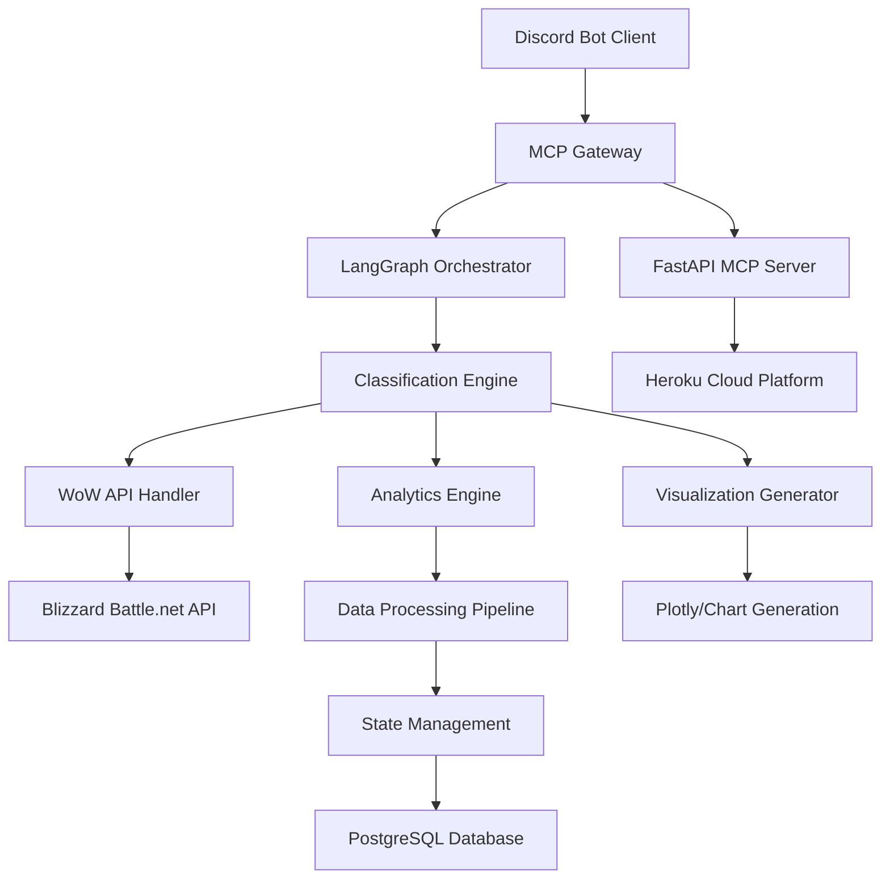

# World of Warcraft Guild Analysis MCP Server
## Product Design Document v1.0

---

## Executive Summary

This document outlines the design and implementation strategy for a comprehensive World of Warcraft Guild analysis MCP (Model Context Protocol) server that integrates with a Discord chat bot client. The system will provide intelligent guild analytics, member performance tracking, and automated insights through a sophisticated orchestration framework using LangChain/LangGraph state management.

### Key Features
- **Intelligent Guild Analytics**: Real-time analysis of guild performance, member activity, and raid progression
- **Discord Bot Integration**: Seamless interaction through Discord with rich visualizations and image handling
- **MCP Protocol Compliance**: Full Model Context Protocol implementation for AI assistant integration
- **Advanced Orchestration**: LangChain/LangGraph state management for complex workflow handling
- **Smart Classification**: OpenAI small models for intelligent request routing and content classification
- **Production-Ready Deployment**: Robust Heroku-based cloud infrastructure with comprehensive error handling

---

## Technical Architecture Overview

### System Architecture Diagram



### Core Components

1. **FastAPI MCP Server**: Central orchestration hub implementing Model Context Protocol
2. **Discord Bot Client**: User interface layer with rich media support
3. **LangGraph State Machine**: Intelligent workflow orchestration and state management
4. **WoW API Integration Layer**: Blizzard Battle.net API connectivity and data transformation
5. **Analytics Processing Engine**: Guild and member performance analysis
6. **Visualization Generator**: Dynamic chart and graph creation using Plotly
7. **Classification System**: OpenAI-powered request routing and content analysis

---

## Core Technologies Stack

### Backend Framework
- **FastAPI 2.0**: Modern, high-performance web framework
- **FastMCP**: Model Context Protocol implementation for AI integration
- **Uvicorn/Gunicorn**: ASGI server for production deployment

### Orchestration & AI
- **LangChain**: Component framework for LLM applications
- **LangGraph**: Stateful agent workflow orchestration
- **OpenAI API**: Small models (GPT-4o-mini) for classification and routing
- **LangSmith**: Observability and debugging for agent workflows

### Data & Visualization
- **PostgreSQL**: Primary database for guild and member data
- **Redis**: Caching layer for API responses and session management
- **Plotly**: Interactive chart and graph generation
- **Pandas**: Data manipulation and analysis

### Discord Integration
- **Discord.py**: Official Discord API wrapper
- **Pillow (PIL)**: Image processing and manipulation
- **Matplotlib/Seaborn**: Additional visualization support

### Deployment & Infrastructure
- **Heroku**: Cloud platform for application hosting
- **Docker**: Containerization for consistent deployments
- **GitHub Actions**: CI/CD pipeline automation
- **Heroku Add-ons**: PostgreSQL, Redis, monitoring services

---

## API Design and Integration

### Blizzard Battle.net API Integration

Based on current WoW API documentation, our server will integrate with these key endpoints:

#### Guild Data APIs
```python
# Primary Guild Endpoints
GET /data/wow/guild/{realm-slug}/{name-slug}
GET /data/wow/guild/{realm-slug}/{name-slug}/roster
GET /data/wow/guild/{realm-slug}/{name-slug}/achievements
GET /data/wow/guild/{realm-slug}/{name-slug}/activity

# Member Profile APIs
GET /profile/wow/character/{realm-slug}/{character-name}
GET /profile/wow/character/{realm-slug}/{character-name}/achievements
GET /profile/wow/character/{realm-slug}/{character-name}/equipment
GET /profile/wow/character/{realm-slug}/{character-name}/mythic-keystone-profile
```

#### Authentication & Rate Limiting
```python
class BlizzardAPIClient:
    def __init__(self):
        self.client_id = os.getenv("BLIZZARD_CLIENT_ID")
        self.client_secret = os.getenv("BLIZZARD_CLIENT_SECRET")
        self.access_token = None
        self.rate_limiter = AsyncLimiter(100, 1)  # 100 requests per second
    
    async def get_access_token(self):
        """OAuth2 client credentials flow for API access"""
        pass
    
    async def make_request(self, endpoint: str, params: dict = None):
        """Rate-limited API request with automatic token refresh"""
        pass
```

### MCP Server Implementation

#### FastAPI-MCP Integration
```python
from fastapi import FastAPI
from fastapi_mcp import FastApiMCP
from langgraph.graph import StateGraph
from langchain_openai import ChatOpenAI

app = FastAPI(title="WoW Guild Analysis MCP Server")

# MCP server configuration
mcp = FastApiMCP(
    app,
    name="WoW Guild Analytics",
    description="Comprehensive World of Warcraft guild analysis and insights",
    base_url=os.getenv("BASE_URL", "http://localhost:8000")
)

# Mount MCP endpoint
mcp.mount("/mcp")

# Core MCP tools
@mcp.tool()
async def analyze_guild_performance(
    realm: str, 
    guild_name: str, 
    analysis_type: str = "comprehensive"
) -> dict:
    """Analyze guild performance metrics and member activity"""
    pass

@mcp.tool()
async def generate_raid_progress_chart(
    realm: str, 
    guild_name: str, 
    raid_tier: str = "current"
) -> str:
    """Generate visual raid progression charts"""
    pass

@mcp.tool()
async def compare_member_performance(
    realm: str, 
    guild_name: str, 
    member_names: list[str],
    metric: str = "dps"
) -> dict:
    """Compare performance metrics across guild members"""
    pass
```

### LangGraph Orchestration Framework

#### State Management Schema
```python
from typing import TypedDict, Annotated
from langgraph.graph.message import add_messages

class GuildAnalysisState(TypedDict):
    messages: Annotated[list, add_messages]
    guild_info: dict
    member_data: list[dict]
    analysis_results: dict
    visualization_urls: list[str]
    error_context: dict
    user_preferences: dict
    classification_result: str
```

#### Workflow Definition
```python
from langgraph.graph import StateGraph, END, START
from langgraph.checkpoint.postgres import PostgresCheckpointer

# Classification node using OpenAI
async def classify_request(state: GuildAnalysisState) -> GuildAnalysisState:
    """Classify user intent and route to appropriate handler"""
    classifier = ChatOpenAI(model="gpt-4o-mini", temperature=0)
    
    classification_prompt = """
    Classify the user's request into one of these categories:
    - guild_overview: General guild information and statistics
    - member_analysis: Individual member performance analysis
    - raid_progress: Raid progression and achievement tracking
    - comparison: Comparative analysis between members or guilds
    - visualization: Chart and graph generation requests
    
    User request: {user_message}
    """
    
    # Implementation details...
    pass

# Core workflow nodes
async def fetch_guild_data(state: GuildAnalysisState) -> GuildAnalysisState:
    """Fetch guild data from Blizzard API"""
    pass

async def analyze_performance(state: GuildAnalysisState) -> GuildAnalysisState:
    """Perform analytical processing on guild data"""
    pass

async def generate_visualizations(state: GuildAnalysisState) -> GuildAnalysisState:
    """Create charts and graphs using Plotly"""
    pass

async def format_discord_response(state: GuildAnalysisState) -> GuildAnalysisState:
    """Format response for Discord bot consumption"""
    pass

# Build the workflow graph
workflow = StateGraph(GuildAnalysisState)
workflow.add_node("classify", classify_request)
workflow.add_node("fetch_data", fetch_guild_data)
workflow.add_node("analyze", analyze_performance)
workflow.add_node("visualize", generate_visualizations)
workflow.add_node("format_response", format_discord_response)

# Define conditional routing
workflow.add_conditional_edges(
    "classify",
    lambda state: state["classification_result"],
    {
        "guild_overview": "fetch_data",
        "member_analysis": "fetch_data",
        "raid_progress": "fetch_data",
        "comparison": "fetch_data",
        "visualization": "visualize"
    }
)

workflow.add_edge("fetch_data", "analyze")
workflow.add_edge("analyze", "visualize")
workflow.add_edge("visualize", "format_response")
workflow.add_edge("format_response", END)

# Add checkpointer for state persistence
checkpointer = PostgresCheckpointer.from_conn_string(
    os.getenv("DATABASE_URL")
)

app_graph = workflow.compile(checkpointer=checkpointer)
```

---

## Discord Bot Client Implementation

### Bot Architecture
```python
import discord
from discord.ext import commands
import aiohttp
import io
from PIL import Image

class WoWGuildBot(commands.Bot):
    def __init__(self):
        intents = discord.Intents.default()
        intents.message_content = True
        super().__init__(command_prefix='!wow ', intents=intents)
        self.mcp_endpoint = os.getenv("MCP_SERVER_URL")
        
    async def setup_hook(self):
        """Initialize MCP client connection"""
        self.session = aiohttp.ClientSession()
        
    async def close(self):
        """Cleanup on bot shutdown"""
        await self.session.close()
        await super().close()

# Discord command implementations
@bot.command(name='guild')
async def analyze_guild(ctx, realm: str, guild_name: str):
    """Analyze guild performance and display results"""
    
    # Show typing indicator for long operations
    async with ctx.typing():
        # Call MCP server
        async with bot.session.post(
            f"{bot.mcp_endpoint}/tools/call",
            json={
                "name": "analyze_guild_performance",
                "arguments": {
                    "realm": realm,
                    "guild_name": guild_name,
                    "analysis_type": "comprehensive"
                }
            }
        ) as response:
            result = await response.json()
    
    # Create rich embed response
    embed = discord.Embed(
        title=f"Guild Analysis: {guild_name}",
        color=discord.Color.blue()
    )
    
    # Add guild statistics
    guild_data = result["guild_info"]
    embed.add_field(
        name="Guild Level", 
        value=guild_data.get("level", "Unknown"), 
        inline=True
    )
    embed.add_field(
        name="Member Count", 
        value=guild_data.get("member_count", "Unknown"), 
        inline=True
    )
    
    # Attach visualization if available
    if result.get("visualization_url"):
        embed.set_image(url=result["visualization_url"])
    
    await ctx.send(embed=embed)

@bot.command(name='compare')
async def compare_members(ctx, realm: str, guild_name: str, *member_names):
    """Compare performance metrics between guild members"""
    
    if len(member_names) < 2:
        await ctx.send("Please provide at least 2 member names to compare.")
        return
    
    async with ctx.typing():
        # Generate comparison chart
        async with bot.session.post(
            f"{bot.mcp_endpoint}/tools/call",
            json={
                "name": "compare_member_performance",
                "arguments": {
                    "realm": realm,
                    "guild_name": guild_name,
                    "member_names": list(member_names),
                    "metric": "dps"
                }
            }
        ) as response:
            result = await response.json()
    
    # Send chart as Discord attachment
    if result.get("chart_data"):
        chart_buffer = io.BytesIO(result["chart_data"])
        file = discord.File(chart_buffer, filename="member_comparison.png")
        await ctx.send(file=file)
    else:
        await ctx.send("Unable to generate comparison chart.")
```

### Image and Visualization Handling
```python
import plotly.graph_objects as go
import plotly.io as pio
from PIL import Image
import io

class VisualizationGenerator:
    @staticmethod
    def create_guild_progress_chart(guild_data: dict) -> bytes:
        """Generate raid progression chart"""
        
        fig = go.Figure()
        
        # Add raid progression data
        raids = guild_data.get("raid_progress", [])
        for raid in raids:
            fig.add_trace(go.Bar(
                name=raid["name"],
                x=raid["difficulties"],
                y=raid["bosses_killed"]
            ))
        
        fig.update_layout(
            title="Guild Raid Progression",
            xaxis_title="Difficulty",
            yaxis_title="Bosses Defeated",
            template="plotly_dark",
            width=800,
            height=600
        )
        
        # Convert to Discord-compatible image
        img_bytes = pio.to_image(fig, format="png")
        return img_bytes
    
    @staticmethod
    def create_member_dps_comparison(member_data: list) -> bytes:
        """Generate member DPS comparison chart"""
        
        names = [m["name"] for m in member_data]
        dps_values = [m["dps"] for m in member_data]
        
        fig = go.Figure(data=[
            go.Bar(x=names, y=dps_values, marker_color='skyblue')
        ])
        
        fig.update_layout(
            title="Member DPS Comparison",
            xaxis_title="Member Name",
            yaxis_title="DPS",
            template="plotly_white",
            width=1000,
            height=600
        )
        
        img_bytes = pio.to_image(fig, format="png")
        return img_bytes
```

---

## Error Handling and Resilience

### Comprehensive Error Handling Strategy
```python
from enum import Enum
from typing import Optional
import logging
from tenacity import retry, stop_after_attempt, wait_exponential

class ErrorType(Enum):
    API_RATE_LIMIT = "api_rate_limit"
    API_AUTHENTICATION = "api_authentication"
    DATA_NOT_FOUND = "data_not_found"
    NETWORK_ERROR = "network_error"
    PROCESSING_ERROR = "processing_error"
    DISCORD_ERROR = "discord_error"

class WoWGuildError(Exception):
    def __init__(self, error_type: ErrorType, message: str, details: Optional[dict] = None):
        self.error_type = error_type
        self.message = message
        self.details = details or {}
        super().__init__(self.message)

# Retry mechanism for API calls
@retry(
    stop=stop_after_attempt(3),
    wait=wait_exponential(multiplier=1, min=4, max=10),
    retry_error_callback=lambda retry_state: None
)
async def resilient_api_call(endpoint: str, params: dict = None):
    """API call with automatic retry and exponential backoff"""
    try:
        # Implementation with proper error handling
        pass
    except aiohttp.ClientResponseError as e:
        if e.status == 429:
            raise WoWGuildError(
                ErrorType.API_RATE_LIMIT,
                "API rate limit exceeded",
                {"status_code": e.status, "retry_after": e.headers.get("Retry-After")}
            )
        elif e.status == 401:
            raise WoWGuildError(
                ErrorType.API_AUTHENTICATION,
                "API authentication failed",
                {"status_code": e.status}
            )
        else:
            raise WoWGuildError(
                ErrorType.NETWORK_ERROR,
                f"API request failed: {e.message}",
                {"status_code": e.status}
            )

# Error handling in LangGraph nodes
async def error_handling_node(state: GuildAnalysisState) -> GuildAnalysisState:
    """Central error handling and recovery"""
    
    error_context = state.get("error_context", {})
    if not error_context:
        return state
    
    error_type = error_context.get("type")
    
    if error_type == ErrorType.API_RATE_LIMIT.value:
        # Implement rate limit backoff
        await asyncio.sleep(error_context.get("retry_after", 60))
        return {**state, "error_context": {}}
    
    elif error_type == ErrorType.DATA_NOT_FOUND.value:
        # Provide helpful suggestions
        suggestions = [
            "Check if the realm name is spelled correctly",
            "Verify that the guild name is accurate",
            "Ensure the guild exists on the specified realm"
        ]
        return {
            **state,
            "messages": state["messages"] + [{
                "role": "assistant",
                "content": f"Guild not found. Suggestions:\n" + "\n".join(f"• {s}" for s in suggestions)
            }]
        }
    
    # Generic error response
    return {
        **state,
        "messages": state["messages"] + [{
            "role": "assistant", 
            "content": "I encountered an error while processing your request. Please try again later."
        }]
    }

# Discord error handling
@bot.event
async def on_command_error(ctx, error):
    """Global Discord command error handler"""
    
    if isinstance(error, commands.CommandNotFound):
        await ctx.send("Command not found. Use `!wow help` for available commands.")
    
    elif isinstance(error, commands.MissingRequiredArgument):
        await ctx.send(f"Missing required argument: {error.param.name}")
    
    elif isinstance(error, WoWGuildError):
        if error.error_type == ErrorType.API_RATE_LIMIT:
            await ctx.send("API rate limit reached. Please try again in a few minutes.")
        elif error.error_type == ErrorType.DATA_NOT_FOUND:
            await ctx.send("Guild or member not found. Please check your input.")
        else:
            await ctx.send("An error occurred while processing your request.")
    
    else:
        logging.error(f"Unexpected error: {error}", exc_info=True)
        await ctx.send("An unexpected error occurred. Please try again later.")
```

---

## Deployment Strategy

### Heroku Deployment Configuration

#### Application Structure
```
wow-guild-mcp/
├── app/
│   ├── __init__.py
│   ├── main.py              # FastAPI application
│   ├── mcp_server.py        # MCP implementation
│   ├── discord_bot.py       # Discord bot client
│   ├── workflows/           # LangGraph workflows
│   ├── api/                 # WoW API integration
│   ├── visualization/       # Chart generation
│   └── models/              # Data models
├── requirements.txt
├── runtime.txt              # Python version
├── Procfile                 # Heroku process types
├── app.json                 # Heroku app configuration
├── docker-compose.yml       # Local development
├── Dockerfile               # Container configuration
└── release-tasks.sh         # Database migrations
```

#### Heroku Configuration Files

**Procfile**
```
web: gunicorn app.main:app --worker-class uvicorn.workers.UvicornWorker --bind 0.0.0.0:$PORT
bot: python -m app.discord_bot
worker: python -m app.background_tasks
```

**requirements.txt**
```
fastapi==0.104.1
fastapi-mcp==0.3.0
uvicorn[standard]==0.24.0
gunicorn==21.2.0
langchain==0.1.0
langgraph==0.0.26
langchain-openai==0.0.5
discord.py==2.3.2
plotly==5.17.0
pandas==2.1.3
psycopg2-binary==2.9.9
redis==5.0.1
aiohttp==3.9.1
pillow==10.1.0
tenacity==8.2.3
python-dotenv==1.0.0
```

**runtime.txt**
```
python-3.11.6
```

**app.json**
```json
{
  "name": "WoW Guild Analysis MCP Server",
  "description": "AI-powered World of Warcraft guild analytics with Discord integration",
  "keywords": ["fastapi", "mcp", "discord", "wow", "gaming", "analytics"],
  "website": "https://github.com/yourusername/wow-guild-mcp",
  "repository": "https://github.com/yourusername/wow-guild-mcp",
  "stack": "heroku-22",
  "buildpacks": [
    {"url": "heroku/python"}
  ],
  "formation": {
    "web": {
      "quantity": 1,
      "size": "basic"
    },
    "bot": {
      "quantity": 1,
      "size": "basic"
    }
  },
  "addons": [
    "heroku-postgresql:mini",
    "heroku-redis:mini",
    "papertrail:choklad"
  ],
  "env": {
    "BLIZZARD_CLIENT_ID": {
      "description": "Blizzard Battle.net API Client ID",
      "required": true
    },
    "BLIZZARD_CLIENT_SECRET": {
      "description": "Blizzard Battle.net API Client Secret",
      "required": true
    },
    "DISCORD_BOT_TOKEN": {
      "description": "Discord bot token",
      "required": true
    },
    "OPENAI_API_KEY": {
      "description": "OpenAI API key for classification",
      "required": true
    },
    "LANGSMITH_API_KEY": {
      "description": "LangSmith API key for observability",
      "required": false
    }
  }
}
```

#### Deployment Commands
```bash
# Initial setup
heroku create wow-guild-mcp-server
heroku addons:create heroku-postgresql:mini
heroku addons:create heroku-redis:mini
heroku addons:create papertrail:choklad

# Set environment variables
heroku config:set BLIZZARD_CLIENT_ID=your_client_id
heroku config:set BLIZZARD_CLIENT_SECRET=your_client_secret
heroku config:set DISCORD_BOT_TOKEN=your_bot_token
heroku config:set OPENAI_API_KEY=your_openai_key

# Deploy application
git push heroku main

# Scale processes
heroku ps:scale web=1 bot=1
```

### Docker Configuration

**Dockerfile**
```dockerfile
FROM python:3.11-slim

# Set environment variables
ENV PYTHONDONTWRITEBYTECODE=1
ENV PYTHONUNBUFFERED=1
ENV PORT=8000

# Install system dependencies
RUN apt-get update && apt-get install -y \
    gcc \
    postgresql-client \
    && rm -rf /var/lib/apt/lists/*

# Set work directory
WORKDIR /app

# Install Python dependencies
COPY requirements.txt .
RUN pip install --no-cache-dir -r requirements.txt

# Copy application code
COPY . .

# Create non-root user
RUN useradd --create-home --shell /bin/bash app
RUN chown -R app:app /app
USER app

# Health check
HEALTHCHECK --interval=30s --timeout=10s --start-period=5s --retries=3 \
  CMD curl -f http://localhost:$PORT/health || exit 1

# Expose port
EXPOSE $PORT

# Run application
CMD gunicorn app.main:app --worker-class uvicorn.workers.UvicornWorker --bind 0.0.0.0:$PORT
```

---

## Performance and Scaling Considerations

### Caching Strategy
```python
import redis.asyncio as aioredis
from functools import wraps
import json
import hashlib

class CacheManager:
    def __init__(self):
        self.redis = aioredis.from_url(os.getenv("REDIS_URL"))
    
    def cache_key(self, *args, **kwargs) -> str:
        """Generate cache key from function arguments"""
        key_data = json.dumps([args, kwargs], sort_keys=True)
        return hashlib.md5(key_data.encode()).hexdigest()
    
    def cached(self, ttl: int = 300):
        """Decorator for caching function results"""
        def decorator(func):
            @wraps(func)
            async def wrapper(*args, **kwargs):
                cache_key = self.cache_key(func.__name__, *args, **kwargs)
                
                # Try to get from cache
                cached_result = await self.redis.get(cache_key)
                if cached_result:
                    return json.loads(cached_result)
                
                # Execute function and cache result
                result = await func(*args, **kwargs)
                await self.redis.setex(
                    cache_key, 
                    ttl, 
                    json.dumps(result, default=str)
                )
                return result
            
            return wrapper
        return decorator

cache_manager = CacheManager()

# Usage example
@cache_manager.cached(ttl=600)  # Cache for 10 minutes
async def get_guild_roster(realm: str, guild_name: str):
    """Fetch guild roster with caching"""
    # Expensive API call
    pass
```

### Database Optimization
```python
from sqlalchemy import create_engine, Index
from sqlalchemy.ext.declarative import declarative_base
from sqlalchemy.orm import sessionmaker
from sqlalchemy.dialects.postgresql import UUID

Base = declarative_base()

class Guild(Base):
    __tablename__ = "guilds"
    
    id = Column(UUID(as_uuid=True), primary_key=True, default=uuid.uuid4)
    realm = Column(String(50), nullable=False)
    name = Column(String(100), nullable=False)
    last_updated = Column(DateTime, default=datetime.utcnow)
    member_count = Column(Integer)
    
    # Composite index for efficient lookups
    __table_args__ = (
        Index('idx_guild_realm_name', 'realm', 'name'),
        Index('idx_guild_updated', 'last_updated'),
    )

class Member(Base):
    __tablename__ = "members"
    
    id = Column(UUID(as_uuid=True), primary_key=True, default=uuid.uuid4)
    guild_id = Column(UUID(as_uuid=True), ForeignKey("guilds.id"))
    character_name = Column(String(50), nullable=False)
    character_class = Column(String(20))
    last_seen = Column(DateTime)
    
    # Index for character lookups
    __table_args__ = (
        Index('idx_member_guild_name', 'guild_id', 'character_name'),
        Index('idx_member_last_seen', 'last_seen'),
    )
```

### Monitoring and Observability
```python
import logging
from prometheus_client import Counter, Histogram, Gauge
import time

# Metrics collection
REQUEST_COUNT = Counter('requests_total', 'Total requests', ['method', 'endpoint'])
REQUEST_DURATION = Histogram('request_duration_seconds', 'Request duration')
ACTIVE_CONNECTIONS = Gauge('active_connections', 'Active connections')

# Structured logging
logging.basicConfig(
    level=logging.INFO,
    format='%(asctime)s - %(name)s - %(levelname)s - %(message)s',
    handlers=[
        logging.StreamHandler(),
        logging.FileHandler('app.log')
    ]
)

logger = logging.getLogger(__name__)

# Middleware for monitoring
@app.middleware("http")
async def monitor_requests(request, call_next):
    start_time = time.time()
    
    response = await call_next(request)
    
    process_time = time.time() - start_time
    REQUEST_DURATION.observe(process_time)
    REQUEST_COUNT.labels(
        method=request.method, 
        endpoint=request.url.path
    ).inc()
    
    logger.info(
        f"{request.method} {request.url.path} - "
        f"{response.status_code} - {process_time:.3f}s"
    )
    
    return response
```

---

## Security Considerations

### API Security
```python
from fastapi import Depends, HTTPException, status
from fastapi.security import HTTPBearer
import jwt
from datetime import datetime, timedelta

security = HTTPBearer()

class SecurityManager:
    def __init__(self):
        self.secret_key = os.getenv("JWT_SECRET_KEY")
        self.algorithm = "HS256"
    
    def create_access_token(self, data: dict):
        """Create JWT access token"""
        to_encode = data.copy()
        expire = datetime.utcnow() + timedelta(hours=24)
        to_encode.update({"exp": expire})
        return jwt.encode(to_encode, self.secret_key, algorithm=self.algorithm)
    
    def verify_token(self, token: str):
        """Verify JWT token"""
        try:
            payload = jwt.decode(token, self.secret_key, algorithms=[self.algorithm])
            return payload
        except jwt.ExpiredSignatureError:
            raise HTTPException(
                status_code=status.HTTP_401_UNAUTHORIZED,
                detail="Token expired"
            )
        except jwt.JWTError:
            raise HTTPException(
                status_code=status.HTTP_401_UNAUTHORIZED,
                detail="Invalid token"
            )

security_manager = SecurityManager()

async def authenticate_user(token: str = Depends(security)):
    """Authentication dependency"""
    return security_manager.verify_token(token.credentials)

# Rate limiting for API endpoints
from slowapi import Limiter, _rate_limit_exceeded_handler
from slowapi.util import get_remote_address
from slowapi.errors import RateLimitExceeded

limiter = Limiter(key_func=get_remote_address)
app.state.limiter = limiter
app.add_exception_handler(RateLimitExceeded, _rate_limit_exceeded_handler)

@app.get("/api/guild/{realm}/{guild_name}")
@limiter.limit("10/minute")
async def get_guild_info(
    request: Request,
    realm: str, 
    guild_name: str,
    user=Depends(authenticate_user)
):
    """Rate-limited guild information endpoint"""
    pass
```

### Data Protection
```python
from cryptography.fernet import Fernet
import os

class DataEncryption:
    def __init__(self):
        key = os.getenv("ENCRYPTION_KEY")
        if not key:
            key = Fernet.generate_key()
            os.environ["ENCRYPTION_KEY"] = key.decode()
        self.cipher = Fernet(key.encode() if isinstance(key, str) else key)
    
    def encrypt(self, data: str) -> str:
        """Encrypt sensitive data"""
        return self.cipher.encrypt(data.encode()).decode()
    
    def decrypt(self, encrypted_data: str) -> str:
        """Decrypt sensitive data"""
        return self.cipher.decrypt(encrypted_data.encode()).decode()

# Use for storing sensitive user data
encryptor = DataEncryption()
```

---

## Development Timeline and Phases

### Phase 1: Core Infrastructure (Weeks 1-3)
- [ ] Set up FastAPI application with MCP integration
- [ ] Implement basic WoW API connectivity
- [ ] Create database schema and models
- [ ] Set up Heroku deployment pipeline
- [ ] Implement basic error handling and logging

### Phase 2: LangGraph Orchestration (Weeks 4-6)
- [ ] Design and implement state management schema
- [ ] Create classification engine with OpenAI integration
- [ ] Build core workflow nodes for data processing
- [ ] Implement workflow routing and conditional logic
- [ ] Add state persistence with PostgreSQL checkpointer

### Phase 3: Discord Bot Integration (Weeks 7-9)
- [ ] Develop Discord bot client with command framework
- [ ] Implement rich embed responses and file attachments
- [ ] Create visualization generation pipeline with Plotly
- [ ] Add image processing and optimization
- [ ] Implement real-time typing indicators and progress updates

### Phase 4: Advanced Analytics (Weeks 10-12)
- [ ] Build comprehensive guild analysis algorithms
- [ ] Implement member performance comparison tools
- [ ] Create raid progression tracking
- [ ] Add predictive analytics for guild performance
- [ ] Implement custom dashboard generation

### Phase 5: Production Hardening (Weeks 13-15)
- [ ] Comprehensive security audit and implementation
- [ ] Performance optimization and caching
- [ ] Monitoring and alerting system setup
- [ ] Load testing and scaling preparation
- [ ] Documentation and user guides

### Phase 6: Launch and Optimization (Weeks 16-18)
- [ ] Beta testing with select Discord servers
- [ ] User feedback integration and bug fixes
- [ ] Performance monitoring and optimization
- [ ] Feature enhancement based on usage patterns
- [ ] Production launch and marketing

---

## Success Metrics and KPIs

### Technical Metrics
- **API Response Time**: < 2 seconds for 95% of requests
- **System Uptime**: 99.5% availability target
- **Error Rate**: < 1% of total requests
- **Cache Hit Rate**: > 70% for frequently accessed data

### User Engagement Metrics
- **Daily Active Users**: Track Discord bot usage
- **Command Success Rate**: Percentage of successful command executions
- **User Retention**: Monthly active user retention rate
- **Feature Adoption**: Usage statistics for different analytical features

### Business Metrics
- **Server Adoption**: Number of Discord servers using the bot
- **User Satisfaction**: Feedback scores and support ticket volume
- **Cost Efficiency**: Infrastructure cost per active user
- **Time to Value**: Average time from installation to first successful analysis

---

## Risk Assessment and Mitigation

### Technical Risks
| Risk | Probability | Impact | Mitigation Strategy |
|------|-------------|--------|-------------------|
| Blizzard API Rate Limits | High | Medium | Implement intelligent caching and request batching |
| Discord API Limitations | Medium | Medium | Design within Discord's rate limits and message size constraints |
| LangGraph Complexity | Medium | High | Thorough testing and gradual feature rollout |
| Database Performance | Low | High | Proper indexing and query optimization |

### Business Risks
| Risk | Probability | Impact | Mitigation Strategy |
|------|-------------|--------|-------------------|
| Changes to WoW API | Medium | High | Monitor Blizzard developer updates, implement flexible API layer |
| Competing Solutions | High | Medium | Focus on unique AI-powered insights and user experience |
| Scalability Costs | Medium | Medium | Implement efficient resource management and pricing tiers |

---

## Conclusion

This comprehensive product design document outlines a robust, scalable solution for World of Warcraft guild analysis using cutting-edge technologies including FastAPI, Model Context Protocol, LangGraph orchestration, and Discord integration. The system is designed to provide intelligent, AI-powered insights while maintaining high performance, security, and user experience standards.

The modular architecture ensures flexibility for future enhancements, while the comprehensive error handling and monitoring systems provide the reliability needed for production deployment. With careful attention to performance optimization and user feedback integration, this solution will establish a new standard for gaming analytics tools.

---

## Appendices

### A. API Endpoint Reference
- Complete listing of all MCP tools and Discord commands
- Request/response schemas and examples
- Error code reference

### B. Deployment Checklist
- Pre-deployment verification steps
- Environment variable configuration
- Database migration procedures
- Rollback procedures

### C. Monitoring and Alerting Configuration
- Key metrics and thresholds
- Alert notification channels
- Dashboard configuration templates

### D. Security Best Practices
- API key management procedures
- Data encryption standards
- User privacy considerations
- Compliance requirements